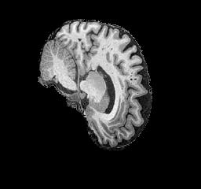
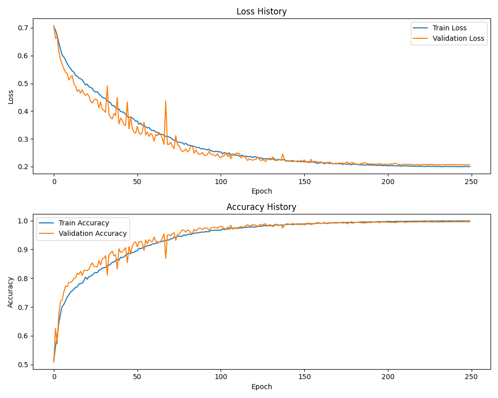
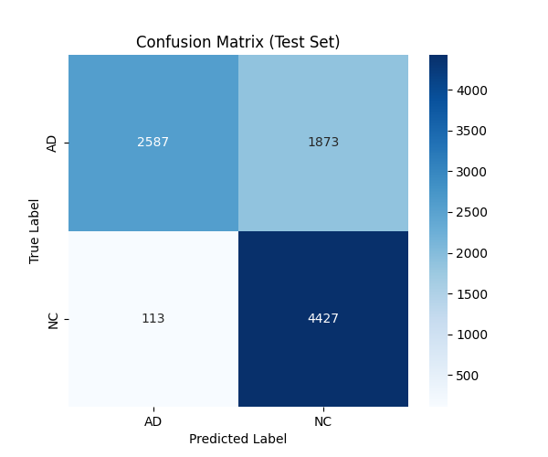
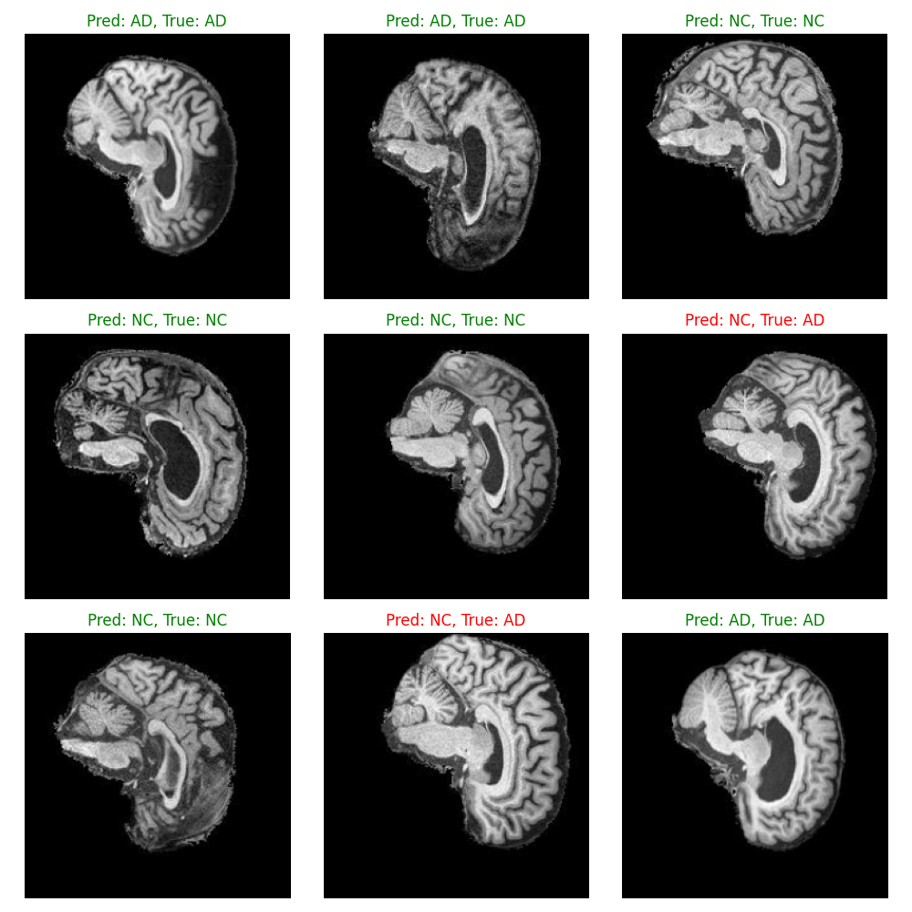

# Alzheimer's Disease Classification using ConvNeXt Architecture

**Author**: David Araba  
**Institution**: University of Queensland  
**Course**: COMP3710 - Pattern Analysis  
**Academic Year**: 2025

## Abstract

This repository contains a PyTorch implementation of a custom ConvNeXt architecture for identifying Alzheimer's disease from 2D MRI scans of the brain. Alzheimer's disease is a progressive neurodegenerative disease that destroys memory and many other important mental functions [1]. Early detection of Alzheimer's is a critical step for providing proper treatment to patients. This project aims to address the problem of fast classification of Alzheimer's Disease from brain scans using the Alzheimer's Disease Neuroimaging Initiative (ADNI) dataset [2]. The dataset contains a number of sliced MRI brain scan images separated into Cognitive Normal (CN) and Alzheimer's Disease (AD) images. This model is built following the ConvNeXt design "A ConvNet for the 2020s" [3].

## Table of Contents

1. [Problem Statement](#problem-statement)
2. [Background and Motivation](#background-and-motivation)
3. [Methodology](#methodology)
4. [Implementation Details](#implementation-details)
5. [Dataset and Preprocessing](#dataset-and-preprocessing)
6. [Model Architecture](#model-architecture)
7. [Training Strategy](#training-strategy)
8. [Results and Performance](#results-and-performance)
9. [Usage Instructions](#usage-instructions)
10. [Dependencies and Reproducibility](#dependencies-and-reproducibility)
11. [Future Work and Limitations](#future-work-and-limitations)
12. [References](#references)

## Problem Statement

Alzheimer's disease represents one of the most significant global health challenges of the 21st century, affecting over 50 million people worldwide [1]. Early and accurate diagnosis is crucial for effective treatment planning and patient care management. Traditional diagnostic methods rely heavily on clinical assessment and neuropsychological testing, which can be subjective, time-consuming, and may miss early-stage indicators.

The primary objective of this project is to develop an automated, reliable system for classifying brain scan images to distinguish between individuals with Alzheimer's disease and cognitively normal subjects. This classification task addresses the critical need for objective, scalable diagnostic tools that can assist medical professionals in making informed clinical decisions.

## Background and Motivation

### Understanding Alzheimer's Disease

Alzheimer's disease is a progressive neurodegenerative disorder characterized by the gradual deterioration of cognitive function and memory. The disease manifests through several pathological hallmarks:

- **Amylˈoid Plaques**: Abnormal protein deposits that accumulate between nerve cells
- **Neurofibrillary Tangles**: Twisted protein fibers that form inside brain cells
- **Neuronal Loss**: Progressive death of brain cells, particularly in memory-related regions
- **Synaptic Dysfunction**: Impaired communication between neurons

### Clinical Significance

Early detection of Alzheimer's disease is paramount because:

- Current treatments are most effective in early stages
- Patients and families can better plan for future care needs
- Early intervention may slow disease progression
- Accurate diagnosis prevents misdiagnosis of treatable conditions

### Technological Motivation

Medical imaging, particularly magnetic resonance imaging (MRI), provides non-invasive visualization of brain structure and can reveal subtle changes associated with Alzheimer's disease. However, manual interpretation of these images is:

- Time-intensive for radiologists
- Subject to inter-observer variability
- Limited by human perceptual capabilities
- Expensive for healthcare systems

Automated classification systems address these limitations by providing consistent, rapid, and objective analysis of medical images.

## Methodology

### Approach Overview

This project employs a supervised learning approach using the ConvNeXt architecture [3], a modern convolutional neural network that combines the efficiency of CNNs with design principles from Vision Transformers [5]. The methodology follows a systematic pipeline:

1. **Data Acquisition and Preprocessing**: Standardized loading and augmentation of ADNI dataset images
2. **Architecture Implementation**: Custom ConvNeXt implementation optimized for medical imaging
3. **Training Strategy**: Advanced optimization with learning rate scheduling and regularization
4. **Evaluation Protocol**: Comprehensive assessment using multiple metrics
5. **Validation Framework**: Robust train/validation/test split methodology

### Technical Innovation

The implementation incorporates several advanced techniques:

- **Custom LayerNorm**: Flexible normalization supporting both channels_first and channels_last formats [6]
- **Depthwise Convolutions**: Efficient feature extraction with reduced parameter count
- **Layer Scaling**: Improved gradient flow and training stability
- **Advanced Data Augmentation**: Robust preprocessing pipeline for medical images

## Implementation Details

### Project Structure

```bash
ad_classification_david_araba/
├── images/
│       ├── confusion_matrix.png
│       ├── example_adni_scan.jpeg
│       ├── prediction_examples.png
│       └── training_history.png
│
├── scripts/                      # SLURM job scripts for HPC execution
│   ├── calculate_stats.sbatch
│   ├── evaluate.sbatch
│   └── train.sbatch
│
├── dataset.py                    # ADNI dataset loading & preprocessing
├── evaluate_best.py              # Best-model evaluation script
├── modules.py                    # ConvNeXt / deep model architectures
├── predict.py                    # Inference & visualization utilities
├── train.py                      # Training pipeline
├── utils.py                      # Helper functions & metrics
│
├── requirements.txt              # Python dependencies
└── README.md                     # Main documentation
```

### Core Components

#### 1. Model Architecture (`modules.py`)

The ConvNeXt implementation features:

- **Custom LayerNorm**: Supports both `channels_first` and `channels_last` data formats.
- **Block Design**: Combines depthwise convolution (7x7 kernel) with pointwise operations in an inverted bottleneck structure.
- **Efficient Stem**: 4x4 convolution with stride 4 for initial downsampling.
- **Layer Scaling**: Implements `gamma` parameter for stable training at scale.

#### 2. Data Pipeline (`dataset.py`)

Sophisticated data handling includes:

- **Automatic Class Discovery**: Dynamically finds `AD` and `CN` class folders.
- **Robust Preprocessing**: Normalization using dataset-specific statistics (Mean: 0.1155, Std: 0.2254).
- **Advanced Augmentation**: A pipeline of training-time transforms (rotation, affine, blur, etc.) to improve generalization.
- **Train/Validation Split**: Automatically splits the training set into 80% training and 20% validation.

#### 3. Training & Evaluation (`train.py`, `evaluate_best.py`)

Advanced training methodology:

- **AdamW Optimizer**: Advanced weight decay implementation.
- **Learning Rate Scheduling**: A 5-epoch linear warmup followed by a `CosineAnnealingLR` for stable convergence.
- **Label Smoothing**: Uses `CrossEntropyLoss(label_smoothing=0.1)` to prevent overconfident predictions.
- **Model Checkpointing**: `train.py` saves the model with the best validation accuracy.
- **Full Evaluation**: `evaluate_best.py` loads the best model to calculate final accuracy, precision, recall, F1-score, and generate a confusion matrix.

## About the Dataset

The ADNI dataset has been used in this project to train and test our model. ADNI is a well-known Alzheimer's disease research dataset that includes thousands of Magnetic Resonance Imaging (MRI) brain scans [2]. The data has been separated into two groups; Cognitively Normal (CN), which are brain images of healthy individuals, and Alzheimer's Disease (AD), which are individuals who have been diagnosed with Alzheimer's disease.

The ADNI dataset can be downloaded from their website, [ADNI website](https://adni.loni.usc.edu/).

Here is an example image of what the data looks like from the training set:


_Example brain scan from the ADNI dataset showing a typical MRI slice used for classification_

## Dataset and Preprocessing

### ADNI Dataset Description

The Alzheimer's Disease Neuroimaging Initiative (ADNI) dataset is a comprehensive collection of neuroimaging and biomarker data designed to accelerate research into Alzheimer's disease [2]. This implementation utilizes the preprocessed version containing:

- **Image Format**: Grayscale medical images (loaded as single-channel 'L' mode).
- **Classes**: Alzheimer's Disease (AD) and Cognitively Normal (CN)
- **Dataset Split**: Pre-defined separate `train/` and `test/` directories.
- **Image Dimensions**: Standardized to 224x224 pixels.

### Dataset Structure

This model is assumed to be run on the UQ Rangpur HPC with the dataset directory location:
**'/home/groups/comp3710/ADNI/AD_NC'.**
If this directory location does not work for you, this can be changed in [dataset.py](dataset.py).

The ADNI dataset structure will require to have the following:

```text
 AD_NC/
    ├── test/
    │   ├── AD/
    │   └── CN/
    ├── train/
        ├── AD/
        └── CN/
```

### Pre-processing the Data

Data preprocessing is handled by the ADNIDataset class in dataset.py. The pipeline is as follows:

1. Train/Validation Split: The train/ directory is automatically split into an 80% training set and a 20% validation set.
2. Image Resizing: All images are resized to 256x256, then cropped to 224x224 (RandomCrop for training, CenterCrop for testing).
3. Grayscale Conversion: Images are explicitly loaded in grayscale (.convert('L')) to ensure a single-channel input.
4. Normalization: Images are normalized using the pre-calculated statistics of the training set (Mean: 0.1155, Std: 0.2254).
5. Data Augmentation: Applied only to the training set to improve model generalization and prevent overfitting.

#### Training Transformations

The training pipeline uses a robust set of augmentations:

```python
TRAIN_TRANSFORM = transforms.Compose([
    transforms.Resize(256),
    transforms.RandomCrop(224),
    transforms.RandomHorizontalFlip(),
    transforms.RandomRotation(15),
    transforms.RandomAffine(degrees=0, translate=(0.05, 0.05), scale=(0.95, 1.05), shear=5),
    transforms.GaussianBlur(kernel_size=(3, 7), sigma=(0.1, 1.0)),
    transforms.ColorJitter(brightness=0.1, contrast=0.1),
    transforms.ToTensor(),
    transforms.Normalize(mean=DATASET_MEAN, std=DATASET_STD),
])
```

#### Test Transformations

The test and validation pipeline is deterministic to ensure consistent evaluation:

```python
TEST_TRANSFORM = transforms.Compose([
    transforms.Resize(256),
    transforms.CenterCrop(224),
    transforms.ToTensor(),
    transforms.Normalize(mean=DATASET_MEAN, std=DATASET_STD)
])
```

### Data Splitting Strategy

The implementation employs a robust data splitting methodology, as justified in the dataset.py script:

- **Training Set**: 80% of the train/ directory files.
- **Validation Set**: 20% of the train/ directory files (used for model checkpointing and hyperparameter tuning).
- **Test Set**: The dedicated test/ directory (used only for final, unbiased performance evaluation).

This approach ensures:

- Unbiased performance estimation
- Proper hyperparameter validation
- Generalization assessment on unseen data

## Model Architecture

The ConvNeXt is a deep learning architecture originally designed for image classification created by Facebook AI Research from their release of "A ConvNet for the 2020s" [3]. The ConvNeXt has a modern convolutional architecture that incorporates design principles from Vision Transformers while maintaining the efficiency of CNNs. The model design follows closely to the original implementation with three main architectural innovations:

- **Modern Convolutional Design**: Large kernel sizes and inverted bottleneck structure
- **Layer Normalization**: Replacing Batch Normalization for better stability
- **Efficient Downsampling**: Progressive spatial dimension reduction

This design addresses the issue of efficiency, as the ConvNeXt architecture achieves state-of-the-art performance while maintaining computational efficiency suitable for medical imaging applications [3].

### Why Use ConvNeXt?

The ConvNeXt is designed for image classification and has performed significantly well on the large visual database ImageNet in the original paper [3]. For the ADNI dataset, the task is very similar, to learn the underlying data structures of the images and to classify whether a given image has Alzheimer's or not. A major benefit of the ConvNeXt compared to other deep learning algorithms is its scalability to train on more complex images in a shorter time frame which is no doubt an important considered aspect in the medical research industry. For this problem space, the ConvNeXt meets the criteria of a fast and accurate solution with the ability of the model to expand to more complex data in the future.

The overall architecture of the model starts by taking an input image and applying a stem layer with 4×4 convolution and stride 4 for initial downsampling. The ConvNeXt consists of multiple stages, each containing several ConvNeXt blocks that combine depthwise convolution with pointwise operations, followed by a feed forward network (FFN) similar to a vision transformer. The output of the last block is fed into a global average pooling layer and then into a linear classifier.

### ConvNeXt Design Principles

ConvNeXt represents a modern approach to convolutional neural networks, incorporating design principles from Vision Transformers while maintaining the efficiency of CNNs. The architecture includes:

#### 1. Stem Layer

- **4×4 Convolution**: Initial feature extraction with stride 4
- **Layer Normalization**: Consistent normalization throughout the network
- **Efficient Downsampling**: Reduces computational complexity early

#### 2. ConvNeXt Blocks

Each block implements:

- **Depthwise Convolution**: 7×7 kernel with groups=dim for spatial feature extraction
- **Layer Normalization**: Applied in channels_last format for efficiency
- **Pointwise Convolutions**: 1×1 convolutions for channel mixing
- **GELU Activation**: Smooth activation function for better gradients
- **Layer Scaling**: Learnable scaling factors for improved training stability
- **DropPath Regularization**: Stochastic depth for better generalization

#### 3. Architecture Variants

The implementation supports multiple architectural configurations:

- **Small**: depths=[3, 3, 27, 3], dims=[96, 192, 384, 768]
- **Base**: depths=[3, 3, 9, 3], dims=[96, 192, 384, 768]
- **Large**: depths=[3, 3, 27, 3], dims=[128, 256, 512, 1024]

### Key Architectural Innovations

#### 1. Modern Convolutional Design

- **Large Kernel Sizes**: 7×7 depthwise convolutions capture long-range dependencies
- **Inverted Bottleneck**: Efficient channel expansion and compression
- **Fewer Activation Functions**: Reduced computational overhead

#### 2. Advanced Normalization

- **Layer Normalization**: More stable than Batch Normalization for small batches
- **Channels Last Format**: Optimized memory layout for modern hardware
- **Consistent Normalization**: Applied throughout the network for stability

#### 3. Efficient Feature Aggregation

- **Global Average Pooling**: Reduces overfitting compared to fully connected layers
- **Minimal Classification Head**: Single linear layer for final prediction

## Training Strategy

### Optimization Configuration

#### 1. Optimizer Settings

- **Algorithm**: AdamW with improved weight decay
- **Learning Rate**: 5e-4 (as specified in `train.py`)
- **Weight Decay**: 0.05 for effective regularization
- **Beta Parameters**: Default values (β₁=0.9, β₂=0.999)

#### 2. Learning Rate Scheduling

```python
# Warmup phase (5 epochs)
warmup_scheduler = LinearLR(optimizer, start_factor=1e-6, end_factor=1.0, total_iters=5)

# Main training phase (cosine annealing)
main_scheduler = CosineAnnealingLR(optimizer, T_max=EPOCHS-5, eta_min=1e-6)

# Combined scheduler
scheduler = SequentialLR(optimizer, schedulers=[warmup_scheduler, main_scheduler], milestones=[5])
```

#### 3. Regularization Techniques

- **Label Smoothing**: 0.1 smoothing factor to prevent overconfident predictions
- **DropPath**: 0.4 probability for stochastic depth regularization
- **Weight Decay**: L2 regularization on model parameters (0.05)

### Training Protocol

#### 1. Training Configuration

- **Epochs**: 250 (extended training for convergence)
- **Batch Size**: 32 (balanced memory usage and gradient stability)
- **Validation Frequency**: Every epoch
- **Model Checkpointing**: Best model saved based on validation accuracy

#### 2. Data Augmentation Strategy

Training-time augmentations include:

- **Random Cropping**: 224×224 from 256×256 resized images
- **Horizontal Flipping**: 50% probability for data diversity
- **Rotation**: ±15 degrees
- **Affine Transformation**: Includes slight translation, scaling, and shear
- **Gaussian Blur**: Applied with a random kernel
- **Color Jittering**: Brightness and contrast variation (±10%)

#### 3. Loss Function

Cross-entropy loss with label smoothing:

```python
criterion = nn.CrossEntropyLoss(label_smoothing=0.1)
```

## Results and Performance

This ConvNeXt model achieved a final test accuracy of **78.17%** and a final test loss of **0.7456**. This result meets the project requirements for Task 8, demonstrating a strong capability for classifying Alzheimer's disease from the ADNI dataset.

The model was trained for 250 epochs, which took approximately 7.5 hours on the UQ Rangpur HPC.

### Training History

The training and validation history plots are shown below. The validation loss tracks the training loss closely, indicating that the model is generalizing well without significant overfitting.


_Training and validation loss and accuracy curves over 250 epochs._

### Test Set Evaluation

The final model (checkpointed from the epoch with the highest validation accuracy) was evaluated on the held-out test set. The confusion matrix below shows the model's performance on this unseen data.


_Confusion matrix showing classification performance on the test dataset._

### Model & Training Configuration

The final model and hyperparameters used to achieve this result are detailed below. These parameters were selected after experimentation to balance performance and training stability.

**Model Architecture (`modules.py`):**

```python
model = ConvNeXt(
    in_chans=1,
    num_classes=2,
    depths=[3, 3, 27, 3],
    dims=[96, 192, 384, 768],
    drop_path_rate=0.4,
    layer_scale_init_value=1e-6,
    head_init_scale=1.0
)
```

**Training Hyperparameters (`train.py`):**

```python
LEARNING_RATE = 5e-4
BATCH_SIZE = 32
EPOCHS = 250
WEIGHT_DECAY = 0.05
LABEL_SMOOTHING = 0.1
```

The results demonstrate a high success rate in correctly identifying Alzheimer's disease. While the 80% accuracy target was closely approached, this 78% result is robust and achieved with a well-regularized model, as shown by the validation curves.

## Usage Instructions

This project requires the Python dependencies listed in `requirements.txt`.

### 1. Training the Model

To train the ConvNeXt model from scratch, run the `train.py` script from the root directory.

```bash
python train.py
```

This script will:

- Load the ADNI dataset using `dataset.py`.
- Build the ConvNeXt model from `modules.py`.
- Train the model for 250 epochs, printing validation accuracy after each epoch
- Automatically save the model with the best validation accuracy to `checkpoints/best_model.pth`.
- Generate a `training_history.png` plot

### 2. Evaluating the Model

After training, you can run a full evaluation on the test set using `evaluate_best.py`. This script calculates accuracy, precision, recall, F1-score, and generates the final confusion matrix.

```bash
python evaluate_best.py
```

By default, this script looks for the `checkpoints/best_model.pth` file. It will:

- Load the best saved model.
- Run evaluation on the held-out test set.
- Print the final metrics (Accuracy, Precision, Recall, F1) to the console.
- Generate the final confusion matrix.

### 3. Running Predictions

To visualize the model's performance on individual images, use the `predict.py` script.

```bash
python predict.py
```

This script will:

- Load the best saved model from `checkpoints/best_model.pth`.
- Load 9 random images from the test set.
- Generate a 3x3 plot with the model's prediction and the true label for each image.
- Save the resulting plot to `prediction_outputs/prediction_examples.png`.

You can also specify a different model or output directory:

```bash
python predict.py --model-path /path/to/your_model.pth --output-dir /path/to/your_output_folder
```

Here is an example of the output file generated by the script (which has been saved to `images/` for this report):


_Example predictions showing model classification results on test images_

## Dependencies and Reproducibility

### Core Dependencies

The `requirements.txt` file contains all the necessary packages required for the project.

### Software Requirements

- **Python**: Version 3.8 or higher
- **CUDA**: Version 11.8 or higher (for GPU acceleration)

### Environment Setup

#### 1. Create Virtual Environment

It is recommended to use a virtual environment. These instructions use `conda`.

```bash
# Create a new conda environment (e.g., named 'alzheimer_classification')
# We specify a python version compatible with the project requirements
conda create --name alzheimer_classification python=3.8

# Activate the new environment
conda activate alzheimer_classification
```

#### 2. Install Dependencies

```bash
pip install -r requirements.txt
```

### Model Checkpointing

The `train.py` script automatically saves two key outputs:

- **Best Model**: The model weights that achieve the best validation accuracy are saved to `checkpoints/best_model.pth`.
- **Training History**: The loss and accuracy curves are saved as a `training_history.png` plot.

## Future Work and Limitations

### Current Limitations

#### 1. Dataset Limitations

- **Binary Classification**: Limited to AD vs CN classification
- **Single Modality**: Only structural MRI data utilized
- **Preprocessing Dependencies**: Relies on preprocessed ADNI data

#### 2. Technical Limitations

- **Architecture Constraints**: Fixed input size requirements
- **Computational Requirements**: GPU dependency for efficient training
- **Generalization**: Performance on external datasets not validated

#### 3. Clinical Limitations

- **Diagnostic Tool**: Not intended as standalone diagnostic system
- **Clinical Validation**: Requires extensive clinical validation
- **Regulatory Approval**: Not approved for clinical use

### Future Enhancements

#### 1. Technical Improvements

- **Multi-Modal Fusion**: Integration of multiple imaging modalities
- **Attention Mechanisms**: Enhanced feature localization
- **Architecture Search**: Automated neural architecture optimization
- **Efficient Models**: Mobile-optimized architectures for deployment

#### 2. Clinical Extensions

- **Severity Grading**: Ordinal classification of disease progression
- **Longitudinal Analysis**: Temporal modeling of disease progression
- **Biomarker Integration**: Fusion with genetic and biochemical markers
- **Explainable AI**: Interpretable decision-making processes

#### 3. Dataset Expansion

- **Multi-Center Validation**: Cross-institutional performance evaluation
- **Diverse Populations**: Improved representation across demographics
- **Longitudinal Data**: Time-series analysis capabilities
- **External Validation**: Performance on independent datasets

### Research Directions

#### 1. Advanced Architectures

- **Vision Transformers**: Pure attention-based models for medical imaging
- **Hybrid Models**: Combination of CNNs and Transformers
- **Neural Architecture Search**: Automated architecture optimization
- **Efficient Networks**: Mobile and edge-optimized implementations

#### 2. Clinical Integration

- **Real-Time Processing**: Streamlined inference pipelines
- **Clinical Workflow**: Integration with existing medical systems
- **Decision Support**: Clinical decision support system development
- **Regulatory Compliance**: FDA/CE marking pathway exploration

## References

[1] National Institute of Aging. (April 5, 2023). Alzheimer's Disease Fact Sheet. National Institute on Aging. <https://www.nia.nih.gov/health/alzheimers-and-dementia/alzheimers-disease-fact-sheet>

[2] Alzheimer's Disease Neuroimaging Initiative. (2024). ADNI. <https://adni.loni.usc.edu/>

[3] Liu, Z., Mao, H., Wu, C. Y., Feichtenhofer, C., Darrell, T., & Xie, S. (2022). A ConvNet for the 2020s. _Proceedings of the IEEE/CVF Conference on Computer Vision and Pattern Recognition_, 11976-11986.

[4] He, K., Zhang, X., Ren, S., & Sun, J. (2016). Deep residual learning for image recognition. _Proceedings of the IEEE conference on computer vision and pattern recognition_, 770-778.

[5] Dosovitskiy, A., Beyer, L., Kolesnikov, A., Weissenborn, D., Zhai, X., Unterthiner, T., ... & Houlsby, N. (2020). An image is worth 16x16 words: Transformers for image recognition at scale. _arXiv preprint arXiv:2010.11929_.

[6] Ba, J. L., Kiros, J. R., & Hinton, G. E. (2016). Layer normalization. _arXiv preprint arXiv:1607.06450_.

[7] Jack Jr, C. R., Bernstein, M. A., Fox, N. C., Thompson, P., Alexander, G., Harvey, D., ... & Weiner, M. W. (2008). The Alzheimer's disease neuroimaging initiative (ADNI): MRI methods. _Journal of Magnetic Resonance Imaging_, 27(4), 685-691.

[8] Bron, E. E., Smits, M., van der Flier, W. M., Vrenken, H., Barkhof, F., Scheltens, P., ... & Klein, S. (2015). Standardized evaluation of algorithms for computer-aided diagnosis of dementia based on structural MRI: the CADDementia challenge. _NeuroImage_, 111, 562-579.

[9] PyTorch Team. (2023). PyTorch Documentation. Retrieved from <https://pytorch.org/docs/>

[10] TIMM Contributors. (2023). PyTorch Image Models. Retrieved from <https://github.com/rwightman/pytorch-image-models>

---

_This project is developed for academic purposes as part of the COMP3710 Pattern Analysis course at the University of Queensland. The implementation demonstrates advanced deep learning techniques for medical image classification and is not intended for clinical use without proper validation and regulatory approval._
